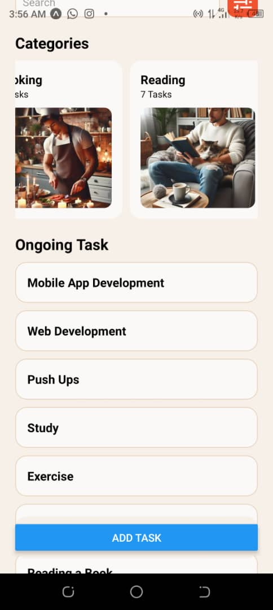
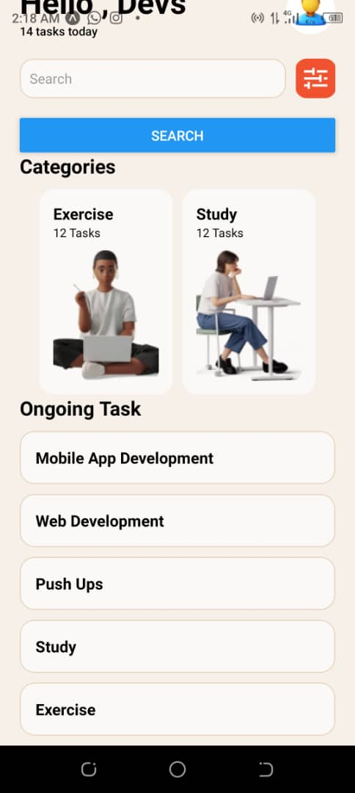

# Task Manager

## Description

The project is a mobile application designed to help users manage their tasks and activities efficiently. It provides features for organizing tasks into categories, setting deadlines, and tracking progress. Users can also add new tasks, search for existing tasks, and mark tasks as completed.

## Features

- **Task Management**: Organize tasks into different categories such as work, study, exercise, etc.
- **Add Tasks**: Add new tasks with titles, descriptions, deadlines, and priority 

## Screenshots
(assets/cleaning.jpeg) 
(assets/cooking.jpeg) 
(assets/hobby.jpeg) 
(assets/reading.jpeg) 
(assets/shopping.jpeg) 
(assets/work.jpeg)
        

## Technologies Used

- **React Native**: For building the mobile application.
- **JavaScript**: Language used for programming logic.


## Installation

1. Clone the repository:

    ```bash
    git clone https://github.com/your-username/project-name.git
    ```

2. Navigate to the project directory:

    ```bash
    cd project-name
    ```

3. Install dependencies:

    ```bash
    npm install
    ```

4. Start the development server:

    ```bash
    npm start
    ```

## Usage

1. Open the application on your mobile device or emulator.
2. Sign in or create a new account to start using the app.
3. Navigate through the different screens to manage tasks, add new tasks, search for tasks, etc.
4. Mark tasks as completed once finished.


